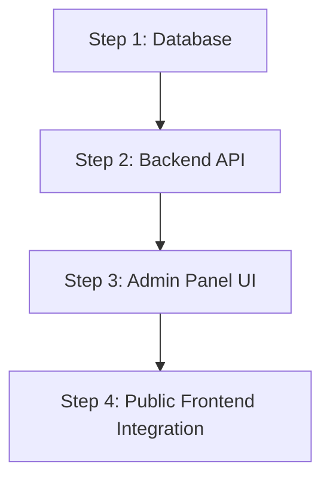

# Team CMS Discovery & Impact Audit

## 1. Overview
This document presents the complete read-only discovery and impact audit for the **Team CMS** module of the SRJ Global Website. It analyzes the existing frontend components, hardcoded data structures, database status, backend infrastructure, admin panel layout, and media handling to formulate a deterministic implementation strategy.

---

## A. Database Status
- **Database Name**: `srj_db`
- **Connection Status**: Configured via [`backend/config/db.js`](file:///Users/macbook/Downloads/SRJ_Global_Website/backend/config/db.js).
- **Current State**: No `team` or `team_members` table exists in `srj_db`.

---

## B. Existing Schema
Current tables in `srj_db` (12 tables):
1. `blogs`
2. `contacts`
3. `faqs`
4. `industries`
5. `job_applications`
6. `jobs`
7. `plan_inquiries`
8. `portfolio`
9. `promotions`
10. `services`
11. `testimonials`
12. `users`

**Team-related Tables**: `0` tables found.

---

## C. Existing Team Records
- **Database Records**: `0` rows.
- **Frontend Static Records**: 4 hardcoded member records found in [`frontend/src/components/about/TeamSection.jsx`](file:///Users/macbook/Downloads/SRJ_Global_Website/frontend/src/components/about/TeamSection.jsx):

| # | Name | Role | Role Class | Bio | Badge | Featured | Online | Verified | Image Source | Social Links |
|---|---|---|---|---|---|---|---|---|---|---|
| 1 | **John Anderson** | CEO | `ceo` | Leading innovation, strategy and global expansion across all verticals. | Team Lead | `true` | `true` | `true` | Remote Unsplash URL | LinkedIn, GitHub, Twitter, Email, Web |
| 2 | **Sarah Chen** | CTO | `cto` | Building scalable AI systems used by millions of users worldwide. | AI Expert | `false` | `true` | `true` | Remote Unsplash URL | LinkedIn, GitHub, Twitter, Email |
| 3 | **David Park** | Senior Developer | `dev` | Full-stack architect crafting performant systems at enterprise scale. | `null` | `false` | `false` | `false` | Remote Unsplash URL | LinkedIn, GitHub, Email |
| 4 | **Emily Rodriguez** | UI Designer | `design` | Crafting intuitive interfaces that delight users and drive conversions. | `null` | `false` | `true` | `false` | Remote Unsplash URL | LinkedIn, GitHub, Twitter |

---

## D. Frontend Components
- **Primary Component**: [`frontend/src/components/about/TeamSection.jsx`](file:///Users/macbook/Downloads/SRJ_Global_Website/frontend/src/components/about/TeamSection.jsx)
- **Styling File**: [`frontend/src/components/about/TeamSection.css`](file:///Users/macbook/Downloads/SRJ_Global_Website/frontend/src/components/about/TeamSection.css)
- **Mounting Status**: Currently **unmounted** (not imported or rendered in `About.jsx`, `App.jsx`, or any other route).
- **Sub-components**: `SpotlightCard` (handles cursor spotlight calculations, avatar rendering, role badges, bio text, social icons, and CTA).

---

## E. Hardcoded Data
- **Location**: Defined directly within `TeamSection.jsx` (lines 13–62) as `const team = [...]`.
- **Count**: 4 team members.
- **Duplication**: No duplicate data arrays found in other components.

---

## F. Backend Status
- **Controllers**: No `teamController.js` exists.
- **Routes**: No `teamRoutes.js` exists.
- **Server Mount**: No `/api/team` route mounted in [`backend/server.js`](file:///Users/macbook/Downloads/SRJ_Global_Website/backend/server.js).
- **Reusable Infrastructure Available**:
  - Auth Middleware: `verifyToken` ([`backend/middleware/authMiddleware.js`](file:///Users/macbook/Downloads/SRJ_Global_Website/backend/middleware/authMiddleware.js))
  - Admin Middleware: `isAdmin` ([`backend/middleware/adminMiddleware.js`](file:///Users/macbook/Downloads/SRJ_Global_Website/backend/middleware/adminMiddleware.js))
  - Upload Middleware: `upload.single("image")` ([`backend/middleware/upload.js`](file:///Users/macbook/Downloads/SRJ_Global_Website/backend/middleware/upload.js))
  - Validation: `express-validator` pattern in [`backend/middleware/validators.js`](file:///Users/macbook/Downloads/SRJ_Global_Website/backend/middleware/validators.js)
  - Error Handling: `AppError` and `asyncHandler` utilities.

---

## G. Admin Panel Status
- **File**: [`frontend/src/components/admin/AdminDashboard.jsx`](file:///Users/macbook/Downloads/SRJ_Global_Website/frontend/src/components/admin/AdminDashboard.jsx)
- **Current State**: No Team tab or state variables currently exist in AdminDashboard.
- **Reusable UI Patterns**: Left-column form (`xl:col-span-1`) + Right-column list view (`xl:col-span-2`), inline status toggle buttons (`PUT /api/team/:id/toggle`), scroll-to-top edit form population, modal/confirm deletion (`DELETE /api/team/:id`), file upload previews, and toast notifications (`showNotification`).

---

## H. Image / Media Handling
- **Current Images**: All 4 hardcoded members use remote Unsplash HTTP image URLs (`https://images.unsplash.com/...`).
- **Target Upload Strategy**:
  - Support both local file uploads (`Multer` storing images in `backend/public/uploads/` with unique filenames) and external image URLs (Unsplash/remote URLs).
  - Image cleanup: Delete local upload files via `fs.unlinkSync` when replacing or deleting team records.

---

## I. Public Usage
- **Target Placement**: Under `About` page ([`frontend/src/components/About.jsx`](file:///Users/macbook/Downloads/SRJ_Global_Website/frontend/src/components/About.jsx)).
- **UI & Animation Features**:
  - Heading: `"Meet the Experts Behind Our Success"`
  - Subtitle: `"A passionate team of engineers, designers, strategists and innovators..."`
  - Framer Motion `fadeUp` stagger animations (`useInView`).
  - Interactive radial spotlight gradient on mouse hover (`SpotlightCard`).
  - Role badge color modifier classes (`tm-role--ceo`, `tm-role--cto`, `tm-role--dev`, `tm-role--design`).
  - Interactive social media icon links (LinkedIn, GitHub, Twitter, Email, Website).

---

## J. Data Ownership Map

| Team Field | Current Source | Current Usage | Future Source of Truth |
|---|---|---|---|
| Member Name (`name`) | Hardcoded in `TeamSection.jsx` | Card heading | `team_members.name` in MySQL |
| Role / Designation (`role`) | Hardcoded in `TeamSection.jsx` | Role badge text | `team_members.role` in MySQL |
| Role CSS Class (`role_class`) | Hardcoded in `TeamSection.jsx` | CSS modifier (`tm-role--{roleClass}`) | `team_members.role_class` in MySQL |
| Bio (`bio`) | Hardcoded in `TeamSection.jsx` | Member biography text | `team_members.bio` in MySQL |
| Avatar Image (`image`) | Hardcoded Unsplash URL | `` src attribute | `team_members.image` in MySQL (Upload / URL) |
| Featured Flag (`featured`) | Hardcoded in `TeamSection.jsx` | Featured card styling | `team_members.featured` in MySQL |
| Online Status (`online`) | Hardcoded in `TeamSection.jsx` | Online indicator dot | `team_members.online` in MySQL |
| Verified Badge (`verified`) | Hardcoded in `TeamSection.jsx` | Verification icon | `team_members.verified` in MySQL |
| Badge Label (`badge`) | Hardcoded in `TeamSection.jsx` | Top tag badge | `team_members.badge` in MySQL |
| LinkedIn URL (`linkedin`) | Hardcoded in `TeamSection.jsx` | Social link button | `team_members.linkedin` in MySQL |
| GitHub URL (`github`) | Hardcoded in `TeamSection.jsx` | Social link button | `team_members.github` in MySQL |
| Twitter URL (`twitter`) | Hardcoded in `TeamSection.jsx` | Social link button | `team_members.twitter` in MySQL |
| Email Address (`email`) | Hardcoded in `TeamSection.jsx` | Mailto link button | `team_members.email` in MySQL |
| Website URL (`website`) | Hardcoded in `TeamSection.jsx` | Web link button | `team_members.website` in MySQL |
| Active Toggle (`is_active`) | Non-existent | Public visibility control | `team_members.is_active` in MySQL |
| Sort Order (`sort_order`) | Array index | Display sequence | `team_members.sort_order` in MySQL |

---

## K. Recommended CMS Data Model

Proposed MySQL table definition for `backend/schema.sql`:

```sql
CREATE TABLE IF NOT EXISTS `team_members` (
  `id` INT AUTO_INCREMENT PRIMARY KEY,
  `name` VARCHAR(255) NOT NULL,
  `role` VARCHAR(150) NOT NULL,
  `role_class` VARCHAR(50) DEFAULT 'dev',
  `bio` TEXT NOT NULL,
  `image` VARCHAR(500) DEFAULT NULL,
  `featured` TINYINT(1) DEFAULT 0,
  `online` TINYINT(1) DEFAULT 1,
  `verified` TINYINT(1) DEFAULT 0,
  `badge` VARCHAR(100) DEFAULT NULL,
  `linkedin` VARCHAR(500) DEFAULT NULL,
  `github` VARCHAR(500) DEFAULT NULL,
  `twitter` VARCHAR(500) DEFAULT NULL,
  `email` VARCHAR(255) DEFAULT NULL,
  `website` VARCHAR(500) DEFAULT NULL,
  `is_active` TINYINT(1) NOT NULL DEFAULT 1,
  `sort_order` INT NOT NULL DEFAULT 0,
  `created_at` TIMESTAMP DEFAULT CURRENT_TIMESTAMP,
  `updated_at` TIMESTAMP DEFAULT CURRENT_TIMESTAMP ON UPDATE CURRENT_TIMESTAMP,
  INDEX `idx_team_is_active` (`is_active`),
  INDEX `idx_team_sort_order` (`sort_order`)
) ENGINE=InnoDB DEFAULT CHARSET=utf8mb4 COLLATE=utf8mb4_unicode_ci;
```

---

## L. Proposed API Contract

| Method | Route Path | Protection | Description | Payload / Response |
|---|---|---|---|---|
| `GET` | `/api/team` | Public | List active team members (`WHERE is_active = 1`) ordered by `sort_order ASC, created_at DESC, id ASC`. | Returns raw array or `{ success: true, team: [...] }`. |
| `GET` | `/api/team/admin` | Protected (`verifyToken` + `isAdmin`) | List all team members (active & inactive). | Returns `{ success: true, team: [...] }`. |
| `POST` | `/api/team` | Protected (`verifyToken` + `isAdmin`, `upload.single("image")`) | Create a new team member. | Form-data or JSON. Returns `201 Created`. |
| `PUT` | `/api/team/:id` | Protected (`verifyToken` + `isAdmin`, `upload.single("image")`) | Update existing team member details. | Partial update, deletes replaced file. Returns `200 OK`. |
| `PUT` | `/api/team/:id/toggle` | Protected (`verifyToken` + `isAdmin`) | Toggle `is_active` status. | Swaps `is_active` (0 $\leftrightarrow$ 1). |
| `DELETE` | `/api/team/:id` | Protected (`verifyToken` + `isAdmin`) | Permanently delete team member. | Removes record and deletes upload image file. |

---

## M. Implementation Plan



- **Step 1 — Database**:
  - Add `team_members` table definition to `backend/schema.sql`.
  - Execute `CREATE TABLE` query in MySQL `srj_db`.
  - Insert initial 4 seed records preserving existing names, roles, bios, badges, images, and social links.

- **Step 2 — Backend API**:
  - Create `backend/controllers/teamController.js` with CRUD methods and image deletion utility.
  - Create `backend/routes/teamRoutes.js` and mount at `/api/team` in `backend/server.js`.
  - Add validator middleware `validateCreateTeam` and `validateUpdateTeam` in `backend/middleware/validators.js`.
  - Run end-to-end API test suite (public, auth, CRUD, toggle, delete, regression).

- **Step 3 — Admin Panel**:
  - Add "Team" tab to sidebar navigation in `AdminDashboard.jsx`.
  - Implement form state, validation, input fields (name, role, role_class, bio, avatar upload/URL, badge, featured, online, verified, social links, sort_order, is_active).
  - Implement list view with edit, toggle, and delete actions.
  - Run `npm run build` verification.

- **Step 4 — Public Frontend Integration**:
  - Mount `TeamSection.jsx` inside `About.jsx` (or `/about` page).
  - Connect `TeamSection.jsx` to `api.get('/team')`.
  - Remove hardcoded `team` array.
  - Add loading skeleton state and empty/error state (`return null`).
  - Run production build (`npm run build`).

---

## N. Risks / Edge Cases
1. **Unmounted Component**: `TeamSection.jsx` is currently not rendered on the site. Mounting it during Step 4 will make the Team section publicly visible for the first time.
2. **Social Links Data Format**: Social links should be cleanly formatted on output into the `socials: { linkedin, github, twitter, email, web }` structure expected by `TeamSection.jsx`.
3. **Safety of Untracked Deleted File**: The file `backend/public/uploads/1788851060523-246555465.jpeg` in git status must remain untouched, uncommitted, and un-staged.

---

## O. Exact Files That Would Need Modification Later

1. `backend/schema.sql` (Step 1)
2. `backend/controllers/teamController.js` [NEW] (Step 2)
3. `backend/routes/teamRoutes.js` [NEW] (Step 2)
4. `backend/middleware/validators.js` (Step 2)
5. `backend/server.js` (Step 2)
6. `frontend/src/components/admin/AdminDashboard.jsx` (Step 3)
7. `frontend/src/components/about/TeamSection.jsx` (Step 4)
8. `frontend/src/components/About.jsx` (Step 4)
9. `team_cms_implementation.md` [NEW] (Step 1–4 Documentation)
